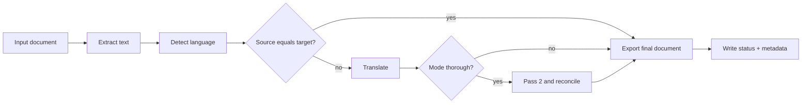

# Document Translator

AI document translation pipeline with configurable quick or dual-pass verification, discrepancy reconciliation, and multi-format export.

Document Translator turns office documents into high-quality translations. It extracts text from common formats, translates via configurable LLM providers (Cursor, OpenAI, Anthropic, or Google — default `cursor:composer-2.5`), runs single-pass (`quick`, default) or dual-pass verification (`--mode thorough`), compares independent passes programmatically when thorough, and uses AI to resolve meaningful differences. The result is a single final document (cover page plus translation) in the chosen export format, with `metadata.json` for API polling and queue integration.

**Current version:** 0.1.0 — see [CHANGELOG.md](CHANGELOG.md) for release history.

**Default target language:** English (`en`). Use `--target-lang` to translate into any ISO 639-1 code (e.g. `es`, `fr`, `de`). When the detected source language matches the target, translation is skipped and text is passed through to export.

**Default translation mode:** `quick` (single pass). Use `--mode thorough` for dual-pass verification and discrepancy reconciliation.

## Table of contents

- [How it works](#how-it-works)
- [Features](#features)
- [Supported formats](#supported-formats)
- [Requirements](#requirements)
- [Installation](#installation)
- [Quick start](#quick-start)
- [Configuration](#configuration)
- [CLI reference](#cli-reference)
- [Job artifacts](#job-artifacts)
- [Pipeline stages and status](#pipeline-stages-and-status)
- [Reconciliation](#reconciliation)
- [Observability](#observability)
- [Python API](#python-api)
- [Integrations](#integrations)
- [Docker](#docker)
- [Development](#development)
- [Contributing](#contributing)
- [License](#license)
- [Changelog](#changelog)
- [Architecture](#architecture)
- [Limitations and roadmap](#limitations-and-roadmap)

## How it works



1. **Extract** — Convert the input file to normalized Markdown with extraction metadata and quality alerts.
2. **Detect** — Identify source language (programmatic detection with AI fallback) and classify whether the document appears to be legal text.
3. **Translate** — Run one full-document translation pass (`quick`, default) or two independent passes (`thorough`), chunked for parallelism.
4. **Reconcile** (thorough only) — Fuzzy-compare sentence pairs; flag spans where similarity is low or protected tokens (dates, amounts, proper nouns) differ. AI reviews flagged spans and adjudicates unresolved discrepancies.
5. **Export** — Embed a one-page translation summary on the front of the final document (`pdf`, `docx`, `doc`, `odt`, `rtf`, `txt`, or `md`), then export the combined file.
6. **Report** — Write `status.json` (polling) and `metadata.json` (terminal API payload with issues, discrepancies, and summary). Working files are removed after the job finishes.

Each job writes artifacts under a stable `runs/{job_id}/` layout so external orchestrators (HTTP APIs, queue workers, cron jobs) can poll progress and fetch outputs without coupling to Python internals.

## Features

- **Multi-format extraction** — PDF (PyMuPDF + optional Tesseract OCR), DOCX, legacy DOC, ODT, RTF, TXT, and Markdown
- **Selectable export format** — PDF, DOCX, DOC, ODT, RTF, TXT, or MD; defaults to matching the input extension
- **Selectable target language** — ISO 639-1 codes via `--target-lang` or `target_lang` in config JSON (default `en`)
- **Translation modes** — `quick` (single pass, default) or `thorough` (dual-pass verification and reconciliation)
- **Single user deliverable** — Translation summary cover page prepended to `05-final.{ext}` (translated into the target language when not English)
- **Quality signals at extraction** — Alerts for empty text, low page density, OCR status, large files, and encoding loss
- **Language detection** — `langdetect` with configurable confidence threshold; Cursor SDK fallback when confidence is low
- **Legal document awareness** — Keyword heuristics plus optional AI confirmation; translation prompts preserve obligations, defined terms, dates, and amounts
- **Extract-only mode** — `--no-translate` skips LLM translation and exports the extracted document body (extraction, detection, and export still run)
- **Dual-pass translation** (`--mode thorough`) — Two full independent passes reduce single-run hallucination risk
- **Programmatic + AI reconciliation** (`--mode thorough`) — RapidFuzz sentence comparison, protected-token checks, semantic equivalence review, and third-pass adjudication
- **Multi-provider LLM** — `provider:model` selector (`--llm`, `list-llms`); Cursor (default), OpenAI, Anthropic, Google Gemini; optional install extras or use the published Docker image (all providers pre-installed)
- **Batch translate** — Multiple input files per CLI invocation; each file gets its own `runs/{job_id}/` tree; `--format json` returns a `BatchJobResult` envelope
- **Preflight checks** — `document-translator check` validates system tools and API keys before enqueueing jobs
- **Job timeout and cancellation** — `--timeout` for cooperative limits; `SIGTERM`/`SIGINT` finalize partial jobs with `JOB_CANCELLED`
- **Terminal webhooks** — optional `--webhook-url` POST on job completion with HMAC signature for Laravel callbacks
- **LLM usage metrics** — `metadata.llm_usage` with `input_tokens`, `output_tokens`, and indicative `estimated_cost_usd`
- **CLI and library** — Subprocess-friendly exit codes and a `DocumentTranslationService` Python API
- **Observability** — Structured logging (text or JSON) and optional Sentry integration

## Supported formats

| Extension | Extraction method | Notes |
|-----------|-------------------|-------|
| `.pdf` | PyMuPDF (+ Tesseract OCR fallback) | Native text extraction; sparse pages OCR'd when Tesseract is installed (`--no-pdf-ocr` to disable) |
| `.docx` | Mammoth | Warnings surfaced if conversion is degraded |
| `.doc` | LibreOffice or antiword | LibreOffice preferred when installed |
| `.odt` | Pandoc | Requires `pandoc` on `PATH` |
| `.rtf` | striprtf | Regex fallback if striprtf is unavailable |
| `.txt`, `.md`, `.markdown` | Direct read | UTF-8 with replacement on invalid sequences |

Unsupported extensions fail at extraction with `UNSUPPORTED_FORMAT`.

### Export formats

| Format | Mechanism | System dependencies |
|--------|-----------|---------------------|
| `pdf` | Pandoc + WeasyPrint | `pandoc`, WeasyPrint system libs |
| `docx`, `odt`, `rtf`, `txt` | Pandoc | `pandoc` |
| `md` | Copy resolved Markdown | none |
| `doc` | Pandoc → DOCX → LibreOffice | `pandoc`, `libreoffice` |

When `--export-format` is omitted, the export format matches the input file extension (e.g. `.docx` in → `05-final.docx`). Unknown input extensions default to `pdf`.

## Requirements

### Python

- Python **3.11+**
- API key for the selected LLM provider (`CURSOR_API_KEY` by default; or `OPENAI_API_KEY`, `ANTHROPIC_API_KEY`, `GOOGLE_API_KEY`)

### System tools

| Tool | Required | Purpose |
|------|----------|---------|
| [Pandoc](https://pandoc.org/) | Yes (export; ODT extraction) | Markdown → PDF, DOCX, ODT, RTF, TXT; ODT input |
| [WeasyPrint](https://weasyprint.org/) system libraries | Yes (PDF export only) | Pandoc PDF engine (`libpango`, `libgdk-pixbuf`, etc.) |
| [LibreOffice](https://www.libreoffice.org/) | Optional | Legacy `.doc` input and `.doc` export |
| [Tesseract](https://github.com/tesseract-ocr/tesseract) | Optional (PDF OCR) | Scanned/image-only PDF text extraction; included in Docker image |

**Debian/Ubuntu example:**

```bash
sudo apt update
sudo apt install pandoc libpango-1.0-0 libpangocairo-1.0-0 libgdk-pixbuf-2.0-0 libffi-dev shared-mime-info
# Optional for stubborn .doc files:
sudo apt install libreoffice
# Optional for scanned PDF OCR:
sudo apt install tesseract-ocr tesseract-ocr-eng
```

WeasyPrint is installed as a Python dependency; the system packages above satisfy its native library requirements on Linux.

## Installation

From a clone of this repository:

```bash
git clone <repository-url> document-translator
cd document-translator

python3 -m venv .venv
source .venv/bin/activate   # Windows: .venv\Scripts\activate

pip install -e ".[dev]"     # development + tests
# Optional LLM provider SDKs (included in published Docker image):
pip install -e ".[openai]"    # or [anthropic], [google]
# Optional Sentry integration:
pip install -e ".[monitoring]"
```

The CLI entry point is `document-translator` (also invokable as `python -m document_translator`).

## Quick start

1. Set your API key (match your chosen `--llm` provider):

```bash
export CURSOR_API_KEY="your-key-here"
# Or: OPENAI_API_KEY, ANTHROPIC_API_KEY, GOOGLE_API_KEY
```

2. Verify the host is ready (optional but recommended for production):

```bash
document-translator check --format json --output-dir runs/
```

3. Translate a document (export format auto-matches the input extension):

```bash
document-translator translate path/to/document.pdf \
  --job-id "$(uuidgen)" \
  --output-dir runs/
```

Override the export format:

```bash
document-translator translate path/to/contract.docx \
  --job-id "$(uuidgen)" \
  --export-format pdf
```

Translate multiple files in one subprocess (each file gets its own job directory):

```bash
document-translator translate path/to/a.pdf path/to/b.docx \
  --job-ids "$(uuidgen)" "$(uuidgen)" \
  --format json
```

4. Inspect outputs:

```bash
ls runs/<job-id>/artifacts/
# 05-final.{ext}   (cover page + translation)

cat runs/<job-id>/metadata.json
```

For automation, use `--format json` to print a `JobResult` payload on stdout and rely on exit codes (see [CLI reference](#cli-reference)).

## Configuration

Settings are loaded from environment variables and optional JSON overrides. `PipelineConfig` uses the `DOCUMENT_TRANSLATOR_` prefix for most fields; a few variables also accept unprefixed aliases for convenience. The CLI does not load `.env` files automatically — copy [`.env.example`](.env.example) to `.env`, fill in values, and `source` it (or export vars in your shell / queue worker).

### Environment variables

| Variable | Required | Default | Description |
|----------|----------|---------|-------------|
| `CURSOR_API_KEY` | Yes (Cursor live runs) | — | Cursor API key |
| `LLM` / `DOCUMENT_TRANSLATOR_LLM` | No | `cursor:composer-2.5` | LLM selector as `provider:model` (e.g. `openai:gpt-4o`) |
| `TRANSLATION_MODEL` | No | `composer-2.5` | **Deprecated** — bare Cursor model; use `LLM` instead |
| `OPENAI_API_KEY` | Yes (OpenAI live runs) | — | OpenAI API key when `llm` starts with `openai:` |
| `ANTHROPIC_API_KEY` | Yes (Anthropic live runs) | — | Anthropic API key when `llm` starts with `anthropic:` |
| `GOOGLE_API_KEY` | Yes (Google live runs) | — | Google API key when `llm` starts with `google:` |
| `DOCUMENT_TRANSLATOR_ROOT` | No | project root | Override project root path |
| `DOCUMENT_TRANSLATOR_RUNS_DIR` | No | `runs` | Default runs directory (relative to `root`) |
| `DOCUMENT_TRANSLATOR_CHUNK_SIZE` | No | `2500` | Max characters per translation chunk |
| `DOCUMENT_TRANSLATOR_CHUNK_OVERLAP_SENTENCES` | No | `2` | Sentence overlap between adjacent chunks |
| `DOCUMENT_TRANSLATOR_SIMILARITY_THRESHOLD` | No | `92.0` | RapidFuzz ratio below which sentences are flagged |
| `DOCUMENT_TRANSLATOR_MAX_CONCURRENT_CHUNKS` | No | `4` | Parallel translation workers per pass |
| `DOCUMENT_TRANSLATOR_LANG_CONFIDENCE_THRESHOLD` | No | `0.85` | Below this, language detection uses AI fallback |
| `DOCUMENT_TRANSLATOR_FAIL_ON_EMPTY_EXTRACTION` | No | `false` | Fail the job if extraction yields no body text |
| `DOCUMENT_TRANSLATOR_PDF_OCR` | No | `true` | Enable per-page OCR fallback for sparse PDF pages |
| `DOCUMENT_TRANSLATOR_PDF_OCR_LANGUAGES` | No | `eng` | Tesseract language pack(s), e.g. `eng+spa` |
| `DOCUMENT_TRANSLATOR_KEEP_WORK_FILES` | No | `false` | Retain intermediate working files after job finalize (debug) |
| `DOCUMENT_TRANSLATOR_JOB_TIMEOUT` / `JOB_TIMEOUT` | No | — | Maximum job duration in seconds (cooperative timeout between pipeline stages) |
| `DOCUMENT_TRANSLATOR_WEBHOOK_URL` / `WEBHOOK_URL` | No | — | HTTPS URL to POST terminal job payload |
| `DOCUMENT_TRANSLATOR_WEBHOOK_SECRET` / `WEBHOOK_SECRET` | No | — | HMAC secret for `X-Document-Translator-Signature` header |
| `DOCUMENT_TRANSLATOR_WEBHOOK_TIMEOUT_SECONDS` | No | `30` | Webhook HTTP timeout in seconds |
| `DOCUMENT_TRANSLATOR_LOG_LEVEL` | No | `INFO` | `DEBUG`, `INFO`, `WARNING`, `ERROR` |
| `DOCUMENT_TRANSLATOR_LOG_FORMAT` | No | `text` | `text` or `json` (JSON logs to stderr) |
| `DOCUMENT_TRANSLATOR_SENTRY_DSN` / `SENTRY_DSN` | No | — | Sentry DSN (requires `[monitoring]` extra) |
| `DOCUMENT_TRANSLATOR_SENTRY_ENVIRONMENT` | No | — | Sentry environment tag (e.g. `production`) |
| `DOCUMENT_TRANSLATOR_SENTRY_TRACES_SAMPLE_RATE` | No | `0.0` | Performance trace sample rate (0.0–1.0) |
| `DOCUMENT_TRANSLATOR_SENTRY_REPORT_SEVERITIES` | No | `error` | Comma-separated severities sent as Sentry events: `error`, `warn`, `info` |

### JSON config file

Pass `--config path/to/config.json` to override `PipelineConfig` fields. Paths `runs_dir` and `root` are resolved as `Path` objects. The same file may include `export_format` (applied to `TranslationOptions` when `--export-format` is not set on the command line), `target_lang` (applied when `--target-lang` is not set), `source_lang` (applied when `--source-lang` is not set), `translation_context` (applied when `--translation-context` is not set), `translation_mode` (applied when `--mode` is not set), `no_translate` (applied when `--no-translate` is not set), and `pdf_ocr` (applied when `--no-pdf-ocr` is not set).

```json
{
  "runs_dir": "/var/translations/runs",
  "llm": "cursor:composer-2.5",
  "chunk_size": 3000,
  "similarity_threshold": 90.0,
  "max_concurrent_chunks": 2,
  "fail_on_empty_extraction": true,
  "export_format": "docx",
  "target_lang": "fr",
  "source_lang": "de",
  "translation_context": "This is a contract between Acme Corp and Beta LLC.",
  "translation_mode": "thorough",
  "keep_work_files": false,
  "job_timeout_seconds": 3600,
  "webhook_url": "https://api.example.com/translations/webhook",
  "webhook_secret": "your-hmac-secret",
  "webhook_https_only": true,
  "max_input_bytes": 20000000,
  "subprocess_timeout_seconds": 300,
  "llm_request_timeout_seconds": 300
}
```

Unknown `PipelineConfig` keys are ignored. Keys handled outside `PipelineConfig` (applied to `TranslationOptions` when the matching CLI flag is omitted) are `export_format`, `target_lang`, `source_lang`, `translation_context`, `translation_mode`, and `pdf_ocr`. All other keys in the JSON file are passed to `PipelineConfig` (e.g. `job_timeout_seconds`, `webhook_url`, `webhook_secret`, `chunk_size`).

`job_timeout_seconds` may also be set via `--timeout` (CLI wins over JSON config) or `DOCUMENT_TRANSLATOR_JOB_TIMEOUT` / `JOB_TIMEOUT` environment variables.

## CLI reference

### Translate

```bash
document-translator translate <input> [<input> ...] [options]
```

| Flag | Description |
|------|-------------|
| `input` | One or more paths to source documents (required) |
| `--job-id UUID` | Job identifier for a single input (1–128 chars: letters, digits, `_`, `-`); a UUID is generated if omitted |
| `--job-ids UUID [UUID ...]` | Job identifier per input; same character rules; count must match inputs; must be unique |
| `--output-dir PATH` | Runs directory (default: `./runs` relative to project root) |
| `--format {text,json}` | Stdout format on completion (default: `text`) |
| `--export-format FORMAT` | Final document format: `pdf`, `docx`, `doc`, `odt`, `rtf`, `txt`, `md` (default: match input extension, else `pdf`) |
| `--target-lang CODE` | Target output language as ISO 639-1 code (default: `en`) |
| `--source-lang CODE` | Source document language (ISO 639-1); skips detection for translation, warns if detection disagrees |
| `--translation-context TEXT` | Per-job context (e.g. contract parties) included in every translation chunk prompt |
| `--mode {quick,thorough}` | Translation mode: `quick` (single pass, default) or `thorough` (dual-pass verification) |
| `--no-translate` | Skip translation; export extracted text without translating (extraction and detection still run) |
| `--no-pdf-ocr` | Disable OCR fallback for scanned/image-only PDFs (PyMuPDF text extraction only) |
| `--timeout SECONDS` | Maximum job duration; fails with `JOB_TIMEOUT` when exceeded (also `DOCUMENT_TRANSLATOR_JOB_TIMEOUT`) |
| `--webhook-url URL` | POST terminal job payload to URL after job artifacts are written (`DOCUMENT_TRANSLATOR_WEBHOOK_URL`; `http://` or `https://`) |
| `--webhook-secret SECRET` | Optional HMAC secret for `X-Document-Translator-Signature` (`DOCUMENT_TRANSLATOR_WEBHOOK_SECRET`) |
| `--llm SELECTOR` | LLM as `provider:model` (e.g. `cursor:composer-2.5`, `openai:gpt-4o`) |
| `--force-overwrite` | Overwrite an existing `runs/{job_id}/` directory |
| `--config PATH` | JSON file with `PipelineConfig` overrides and optional `export_format` / `target_lang` / `source_lang` / `translation_context` / `translation_mode` / `no_translate` / `pdf_ocr` / `job_timeout_seconds` / `webhook_url` / `webhook_secret` |

### List LLMs

```bash
document-translator list-llms [--format {text,json}]
```

Prints the supported LLM catalog from `supported_llms()` (`provider:model`, label, required env key).

### Check

```bash
document-translator check [--format {text,json}] [options]
```

Verifies the host is ready to run translation jobs before accepting uploads. Checks pandoc, weasyprint (for PDF export), Tesseract (when PDF OCR is enabled), the selected LLM provider package and API key, and that the runs directory is writable.

| Flag | Description |
|------|-------------|
| `--format {text,json}` | Output format (default: `text`) |
| `--llm SELECTOR` | LLM selector to validate (default: from config) |
| `--export-format FORMAT` | Validate dependencies for a specific export format |
| `--output-dir PATH` | Runs directory to verify is writable |
| `--require-ocr` | Treat missing Tesseract as a failure (default: warn when OCR enabled) |
| `--no-pdf-ocr` | Skip Tesseract check |

Exit code `0` when all required checks pass; `1` when any required check fails. JSON output includes `ready` and a `checks` array with `name`, `status` (`ok` / `warn` / `fail`), `message`, and `required`.

### Exit codes

| Code | Meaning |
|------|---------|
| `0` | Success (`completed`) |
| `1` | Startup/config error (missing input, job exists, invalid config, invalid `--target-lang`, etc.) |
| `2` | Pipeline failure (`failed`) |
| `3` | Completed with warnings (`completed_with_warnings`) — e.g. export failed |

Treat exit code `3` as a successful translation with degraded outputs; check `artifact_availability.final_output` and `metadata.issues`.

### JSON stdout shape

With `--format json`, stdout contains the API-oriented `JobResult` dump:

```json
{
  "job_id": "uuid",
  "status": "completed",
  "artifacts": { "final_output": "/path/to/05-final.pdf", "metadata_json": "...", "status_json": "..." },
  "artifact_availability": { "final_output": true, "metadata_json": true, "status_json": true },
  "metadata": {
    "source_lang": "de",
    "target_lang": "en",
    "model": "cursor:composer-2.5",
    "export_format": "pdf",
    "final_exported": true,
    "summary": { "headline": "Translation completed successfully.", "warnings": [], "review_items": [] },
    "discrepancies": [],
    "duration_seconds": 42.1,
    "llm_call_count": 12,
    "llm_usage": {
      "input_tokens": 18420,
      "output_tokens": 16200,
      "estimated_cost_usd": 0.185025
    }
  },
  "issues": [],
  "discrepancies": [],
  "discrepancy_count": 0,
  "unresolved_breaking_count": 0,
  "error_message": null,
  "error_code": null,
  "failed_stage": null
}
```

With multiple inputs and `--format json`, stdout contains a batch envelope instead:

```json
{
  "status": "completed_with_warnings",
  "job_count": 2,
  "completed_count": 1,
  "failed_count": 0,
  "completed_with_warnings_count": 1,
  "jobs": [ "...JobResult per file, input order..." ]
}
```

Each file still writes its own `runs/{job_id}/` tree. Exit code reflects the worst per-file status (`2` > `3` > `0`). Processing continues after per-file failures.

## Job artifacts

After a job completes, only the user deliverable and API files remain (intermediate working files are deleted unless `keep_work_files` is enabled in config):

```
runs/{job_id}/
  artifacts/
    05-final.{export_format}   # cover page + translation (e.g. 05-final.pdf)
  status.json                  # polling: in_progress → terminal
  metadata.json                # terminal API payload (issues, discrepancies, summary)
```

During processing, intermediate files exist temporarily under `artifacts/` and `input/` but are removed on finalize.

`status.json` is written atomically (temp file + rename) after each stage transition.

### status.json

```json
{
  "job_id": "uuid",
  "stage": "translating",
  "status": "in_progress",
  "terminal_status": null,
  "message": "Translating (pass 1)",
  "progress": 0.3,
  "issue_count": 0,
  "error_code": null,
  "job_timeout_seconds": 3600,
  "elapsed_seconds": 42.5,
  "updated_at": "2026-06-17T12:00:00+00:00"
}
```

When the job finishes, `status` becomes `terminal` and `terminal_status` is one of `completed`, `completed_with_warnings`, or `failed`.

### metadata.json

Includes `source_lang`, `source_lang_override`, `target_lang`, `translation_mode`, `translation_context`, `source_lang_confidence`, `is_legal_document`, `model`, `page_count`, `chunk_count`, `duration_seconds`, `job_timeout_seconds`, `llm_call_count`, `llm_usage` (`input_tokens`, `output_tokens`, `estimated_cost_usd`), `discrepancy_count`, `unresolved_breaking_count`, `export_format`, `final_exported`, `summary`, `discrepancies[]`, `issues[]`, `artifact_availability`, and on failure `error_code`, `error_message`, and `failed_stage`.

`summary` is a user-facing headline plus capped `warnings` and `review_items` lists for API consumers. The same information appears on the cover page of `05-final.{ext}` (the exported cover is translated into the target language when `--target-lang` is not `en`; `metadata.summary` stays in English for API stability).

### PipelineIssue

Issues appear in `metadata.issues`, the CLI JSON payload, and optionally Sentry:

```json
{
  "code": "EXPORT_FAILED",
  "severity": "warn",
  "message": "pandoc failed ...",
  "stage": "exporting",
  "scope": { "format": "pdf" }
}
```

| Code | Typical severity | Meaning |
|------|------------------|---------|
| `UNSUPPORTED_FORMAT` | error | File extension not supported |
| `EMPTY_EXTRACTION` | warn / error | No text extracted (`fail_on_empty_extraction` controls failure) |
| `LOW_TEXT_DENSITY` | warn | Few characters per page — possible scanned PDF (OCR may not have helped) |
| `OCR_APPLIED` | info | One or more PDF pages extracted via Tesseract OCR |
| `OCR_UNAVAILABLE` | warn | Sparse PDF pages detected but Tesseract is not installed |
| `LARGE_INPUT_FILE` | warn | Input exceeds 20 MB |
| `ENCODING_LOSS` | warn | Invalid UTF-8 replaced during read |
| `CONVERSION_DEGRADED` | warn | DOCX/RTF conversion used a fallback or reported warnings |
| `EXPORT_FAILED` | warn | Export failed (pandoc/weasyprint or format conversion); see `metadata.json` for details |
| `COVER_TRANSLATION_FAILED` | warn | Cover page could not be translated; English cover used in final document |
| `LANGUAGE_LOW_CONFIDENCE` | warn | AI used for language detection |
| `LEGAL_CLASSIFICATION_AI` | info | AI confirmed ambiguous legal classification |
| `LLM_RESPONSE_PARSE_FAILED` | warn | Could not parse an AI JSON response; heuristic used |
| `CHUNK_COUNT_MISMATCH` | error | Translation passes returned different chunk counts |
| `PIPELINE_FAILED` | error | Unexpected failure |
| `CONFIGURATION_ERROR` | error | Missing API key or invalid setup |
| `JOB_TIMEOUT` | error | Cooperative job timeout exceeded (`--timeout` / `DOCUMENT_TRANSLATOR_JOB_TIMEOUT`) |
| `JOB_CANCELLED` | error | Job cancelled via `SIGTERM` / `SIGINT` |
| `SOURCE_LANG_MISMATCH` | warn | `--source-lang` override disagrees with detected language |
| `WEBHOOK_FAILED` | warn | Terminal webhook POST failed (job may still complete; check `metadata.issues`) |

By default, only `error` severity issues create Sentry events; warnings are breadcrumbs unless `DOCUMENT_TRANSLATOR_SENTRY_REPORT_SEVERITIES=error,warn`.

### discrepancies (in metadata.json)

Discrepancy records are embedded in `metadata.json` and the CLI JSON payload (`discrepancies` top-level array). Fields:

| Field | Description |
|-------|-------------|
| `chunk_index`, `sentence_index` | Location in the document |
| `translation_1`, `translation_2` | Competing sentence variants |
| `source_span` | Original source text for the span |
| `equivalent` | Whether AI judged the variants semantically equivalent |
| `severity` | `low`, `medium`, `high`, or `breaking` |
| `explanation` | AI or heuristic explanation |
| `resolved` | Whether a final variant was chosen |
| `resolution`, `chosen_variant` | Adjudication outcome |

## Pipeline stages and status

| Stage | Progress (approx.) | Description |
|-------|-------------------|-------------|
| `queued` | 0.0 | Job directory created |
| `extracting` | 0.05 | Text extraction and input copy |
| `detecting_language` | 0.15 | Language detection and legal classification |
| `translating` | 0.3–0.65 (`quick`) or 0.3–0.5 (`thorough`) | Single pass (`quick`) or pass 1 then pass 2 (`thorough`) |
| `reconciling` | 0.7 | Compare, semantic review, adjudication (`thorough` only) |
| `exporting` | 0.9 | Final document export |
| `completed` / `failed` | 1.0 | Terminal |

When the detected source language matches `--target-lang`, documents skip `translating` and `reconciling` content work but still run detection and export.

## Reconciliation

Reconciliation runs only in `thorough` mode. It is designed to catch meaningful divergence between independent translation passes without reviewing every sentence with AI.

1. **Chunk alignment** — Source and both translation passes are split into matching chunks (same chunker settings).
2. **Sentence comparison** — Within each chunk, sentences are aligned by index. RapidFuzz `ratio` scores below `similarity_threshold` (default 92) are flagged.
3. **Protected tokens** — Dates, percentages, currency amounts, bare numbers, and proper-noun-like tokens are compared; mismatches flag the sentence even when fuzzy similarity is high.
4. **Semantic review** — Flagged pairs are sent to the LLM for equivalence analysis and severity assignment.
5. **Adjudication** — Unresolved non-equivalent pairs receive a third-pass translation from the source span; the pipeline records the chosen variant and explanation.

Breaking discrepancies that remain unresolved are counted in `unresolved_breaking_count` for downstream quality gates.

## Observability

### Logging

Logging is configured on CLI startup. Use `DOCUMENT_TRANSLATOR_LOG_FORMAT=json` when a parent process captures stderr (e.g. a queue worker aggregating subprocess logs). Log records include `job_id`, `stage`, and `progress` where applicable.

### Sentry

Install the monitoring extra and set a DSN:

```bash
pip install -e ".[monitoring]"
export SENTRY_DSN="https://..."
export DOCUMENT_TRANSLATOR_SENTRY_ENVIRONMENT=production
```

Each CLI invocation runs as one Sentry transaction (`document_translator.translate`). Sentry is for operators and developers—not a substitute for `status.json` polling or the user-facing cover page in the final document.

## Python API

```python
from pathlib import Path

from document_translator import BatchJobResult, DocumentTranslationService, ExportFormat, PipelineConfig, TranslationOptions, supported_llms
from document_translator.types import TranslationMode

config = PipelineConfig(
    runs_dir=Path("runs"),
    llm="cursor:composer-2.5",
    cursor_api_key="...",  # or set CURSOR_API_KEY in the environment
)
service = DocumentTranslationService(config=config)

result = service.translate(
    Path("contract.docx"),
    TranslationOptions(
        job_id="my-job-id",
        export_format=ExportFormat.PDF,
        target_lang="fr",
        translation_mode=TranslationMode.THOROUGH,
    ),
)

print(result.status, result.artifacts.final_output)
print(result.metadata.source_lang, result.metadata.target_lang, result.metadata.export_format, result.metadata.summary)

# Multiple files in one service call (sequential; continues after per-file failures):
batch = service.translate_batch(
    [
        (Path("a.pdf"), TranslationOptions(job_id="job-a", target_lang="es")),
        (Path("b.docx"), TranslationOptions(job_id="job-b", target_lang="es")),
    ]
)
print(batch.status, len(batch.jobs))
```

Inject a custom `LLMClient` (e.g. `MockLLMClient` in tests) via `DocumentTranslationService(config=..., llm=...)`.

List supported selectors with `supported_llms()` or `document-translator list-llms`. Optional provider SDKs: `pip install 'document-translator[openai]'`, `[anthropic]`, or `[google]`.

## Integrations

Integration guides live under [`docs/integration/`](docs/integration/):

- [Laravel](docs/integration/Laravel.md) — HTTP API, queue worker, webhooks, batch translate, subprocess orchestration
- [Docker](docs/integration/Docker.md) — containerized CLI, GHCR images, preflight, queue workers

The CLI contract (`--job-id`, artifact layout, `status.json`, exit codes) is intentionally stable for any language or framework that can spawn a subprocess and read JSON from disk.

## Docker

Pre-built images are published to GitHub Container Registry on release tags:

```bash
docker pull ghcr.io/aragusnz/tool-ai-document-translator:0.1.0
# or :latest
```

Images include **all LLM provider extras** (Cursor, OpenAI, Anthropic, Google Gemini) plus monitoring — pass `--llm provider:model` and the matching API key at runtime.

Quick start:

```bash
docker build -t document-translator .
docker run --rm document-translator --version
docker run --rm document-translator list-llms

# Preflight
docker run --rm -e CURSOR_API_KEY -v "$(pwd)/runs:/runs" \
  document-translator check --format json --output-dir /runs

docker run --rm -e CURSOR_API_KEY \
  -v "$(pwd)/input:/input:ro" -v "$(pwd)/runs:/runs" \
  document-translator translate /input/document.pdf \
    --job-id "$(uuidgen)" --output-dir /runs --format json

# Or OpenAI (same image)
docker run --rm -e OPENAI_API_KEY \
  -v "$(pwd)/input:/input:ro" -v "$(pwd)/runs:/runs" \
  document-translator translate /input/document.pdf \
    --llm openai:gpt-4o --job-id "$(uuidgen)" --output-dir /runs --format json
```

Full volume mounts, exit codes, webhooks, and Laravel `docker run` examples: [docs/integration/Docker.md](docs/integration/Docker.md).

## Development

[](https://github.com/AragusNZ/tool-ai-document-translator/actions/workflows/test.yml)

AI-assisted development: see [AGENTS.md](AGENTS.md) and [.cursor/README.md](.cursor/README.md).

```bash
pip install -e ".[dev]"

# Run tests
pytest

# With coverage (85% line coverage enforced in CI)
pytest --cov=document_translator --cov-report=term-missing

# Marker examples
pytest -m "not integration"          # unit tests only
pytest -m requires_pandoc              # needs pandoc on PATH
pytest -m requires_weasyprint          # needs weasyprint + system libs
```

Live `CURSOR_API_KEY` tests are intentionally excluded; use `MockLLMClient` for deterministic tests.

See [CONTRIBUTING.md](CONTRIBUTING.md) for fork/PR workflow, pytest commands, and changelog requirements. Version policy and releases: [.cursor/docs/versioning.md](.cursor/docs/versioning.md) (`python scripts/release.py <patch|minor|major> --dry-run` to preview). Security reports: [SECURITY.md](SECURITY.md).

Project layout:

```
src/document_translator/
  cli.py                 # CLI entry point
  pipeline.py            # DocumentTranslationService orchestration
  config/                # constants, formats, languages, PipelineConfig
  lib/                   # LLM clients, chunking, preflight, webhooks, subprocess helpers
  extract/               # per-format text extraction
  detect/                # language + legal classification
  translate/             # translation prompts and dual-pass orchestration
  reconcile/             # compare, analyze, resolve discrepancies
  export/                # Markdown → PDF, DOCX, ODT, RTF, TXT, DOC
  report/                # cover page + IssueCollector
  observability/         # logging and Sentry
  storage/               # job directory layout
docs/integration/        # Laravel and Docker integration guides
tests/
scripts/                 # release.py and tooling
```

## Changelog

Release history: [CHANGELOG.md](CHANGELOG.md). In-flight changes go under `## [Unreleased]` until a version is tagged.

## Architecture

| Layer | Responsibility |
|-------|----------------|
| **Programmatic** | Extraction, chunking, language detection, fuzzy diff, protected-token checks, cover page + multi-format export, artifact I/O, webhooks, preflight |
| **AI (LLM providers)** | Translation (one or two passes), semantic discrepancy review, adjudication, language-detection fallback, legal classification confirmation |

Design principles:

- **Subprocess-first** — Stateless CLI with filesystem artifacts; no embedded HTTP server required.
- **Fail with context** — Structured `IssueCode` values, stage attribution, and terminal `status.json` / `metadata.json` on failure. Intermediate working files are removed unless `keep_work_files` is enabled.
- **Degrade gracefully** — Export failure yields `completed_with_warnings`; details are in `metadata.json`.
- **Auditability** — Thorough mode dual passes plus embedded `metadata.discrepancies` provide a traceable quality trail.

## Limitations and roadmap

Current limitations worth knowing before production use:

- **Scanned PDF OCR** — Requires Tesseract on the host (included in the Docker image). Set `DOCUMENT_TRANSLATOR_PDF_OCR_LANGUAGES` to match the document language (e.g. `spa` for Spanish). Use `--no-pdf-ocr` to skip OCR.
- **Job timeouts and cancellation** — Cooperative `--timeout` between stages; queue workers should set `Process::setTimeout()` slightly above the CLI timeout so `SIGTERM` yields `JOB_CANCELLED` in `status.json`.
- **Rate limits** — All LLM clients retry transient errors (429, 5xx, Cursor `is_retryable`) via `lib/llm/retry.py` with exponential backoff and `Retry-After` / `retry_after` when provided (default: up to 6 attempts).

See [ROADMAP.md](ROADMAP.md) for planned features.

## Contributing

Fork, branch, run `pytest --cov-fail-under=85`, update [README.md](README.md) and [CHANGELOG.md](CHANGELOG.md) for user-visible changes, then open a PR. Details: [CONTRIBUTING.md](CONTRIBUTING.md).

## License

MIT — see [LICENSE](LICENSE).
