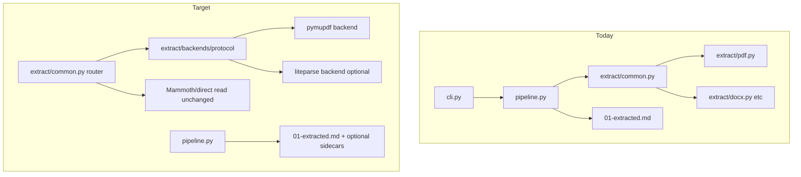
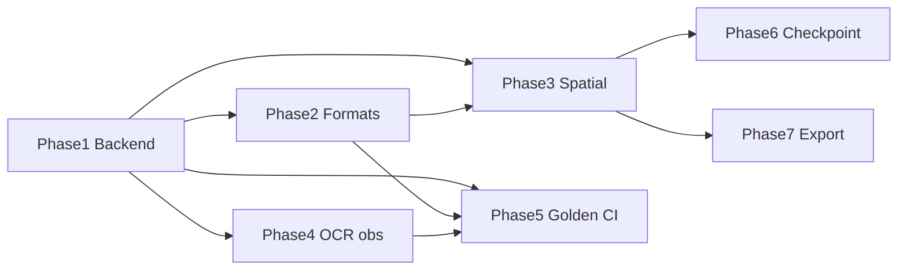

# Phased Roadmap Implementation Plan

## Current baseline

Extraction is a single dispatcher in [`extract/common.py`](src/document_translator/extract/common.py) with per-format functions and PDF logic in [`extract/pdf.py`](src/document_translator/extract/pdf.py) (PyMuPDF + Tesseract). The pipeline calls `extract_single_file()` once in [`pipeline.py`](src/document_translator/pipeline.py) and writes `artifacts/01-extracted.md` via [`storage/paths.py`](src/document_translator/storage/paths.py). Config lives in [`PipelineConfig`](src/document_translator/config/settings.py); supported inputs are fixed in [`config/formats.py`](src/document_translator/config/formats.py).



## Guiding constraints

- **CLI contract:** New optional artifacts (`01-extraction-layout.json`, `screenshots/`) are additive — use `cli-contract-change` skill when touching [`storage/paths.py`](src/document_translator/storage/paths.py), [`models.py`](src/document_translator/models.py) `artifact_availability`, or JSON API fields.
- **LiteParse stays optional:** Add `[project.optional-dependencies] extract-liteparse = ["liteparse>=2.0"]` in [`pyproject.toml`](pyproject.toml); lazy-import in adapter so default install never requires Rust wheels.
- **Pipeline stays thin:** All backend logic in `extract/`; [`pipeline.py`](src/document_translator/pipeline.py) only passes `PipelineConfig` and writes artifacts returned by extract layer.
- **Every phase ends with:** `pytest -m "not integration"` + coverage ≥85%, README audit, CHANGELOG `[Unreleased]` entry.

---

## Phase 1 — Pluggable extraction foundation

**Goal:** Introduce backend abstraction without changing default behavior for existing users.

### 1.1 Backend interface

Create `extract/backends/`:

| File | Responsibility |
|------|----------------|
| `protocol.py` | `ExtractBackend` protocol: `extract(path, *, config) -> ExtractionResult` |
| `pymupdf.py` | Move current [`extract/pdf.py`](src/document_translator/extract/pdf.py) logic here (or delegate to it) |
| `liteparse.py` | Adapter: `LiteParse().parse()` → `ExtractionResult`; `ImportError` → clear message to install extra |
| `routing.py` | `resolve_backend(suffix, config) -> ExtractBackend` |

Extend [`ExtractionResult`](src/document_translator/extract/common.py) minimally if needed (`extract_backend: str | None = None`).

### 1.2 Config and CLI

Add to [`PipelineConfig`](src/document_translator/config/settings.py):

```python
extract_backend: Literal["auto", "pymupdf", "liteparse"] = "auto"
```

Wire in [`cli.py`](src/document_translator/cli.py): `--extract-backend` on `translate` and `check`; support in `--config` JSON. Env: `DOCUMENT_TRANSLATOR_EXTRACT_BACKEND`.

**Routing rules (`auto`):**

- `.pdf` → `pymupdf`
- `.pptx`, `.xlsx`, `.png`, `.jpg`, etc. → `liteparse` if installed, else fail with actionable error
- `.docx`, `.txt`, `.rtf`, `.odt`, `.doc` → existing per-format paths (unchanged)

Refactor [`extract_single_file()`](src/document_translator/extract/common.py): PDF and LiteParse-routed formats go through backend; others unchanged.

### 1.3 Packaging and Docker

- `extract-liteparse` optional extra in [`pyproject.toml`](pyproject.toml)
- Document in README; optional second Docker tag or build arg `WITH_LITEPARSE=1` (defer full Docker change to Phase 2 if time-boxed)

### 1.4 Tests and docs

- `tests/test_extract_backends.py` — mock LiteParse, routing matrix, ImportError path
- Refactor existing [`tests/test_extract.py`](tests/test_extract.py) / [`tests/test_extract_formats.py`](tests/test_extract_formats.py) as needed
- Start **“Adding an extract backend”** section in [`AGENTS.md`](AGENTS.md) and [`.cursor/docs/architecture.md`](.cursor/docs/architecture.md)

### 1.5 Benchmark spike (non-blocking gate)

- `tools/extract-eval/README.md` + script comparing pymupdf vs liteparse on 5–10 sample PDFs from `other-projects/liteparse/demo/docs/`
- Results inform Phase 2 default routing; do not block Phase 1 merge

**Exit criteria:** Default PDF jobs behave identically; `--extract-backend liteparse` works when extra installed; no contract break.

---

## Phase 2 — New input formats and preflight

**Goal:** PPTX/XLSX/images via LiteParse; extend `check`; begin quality harness.

### 2.1 Format registry

Extend [`config/formats.py`](src/document_translator/config/formats.py):

- Add suffixes: `.pptx`, `.ppt`, `.xlsx`, `.xls`, `.png`, `.jpg`, `.jpeg`, `.tiff`, `.webp` (mirror LiteParse `conversion.rs` subset)
- Map to default export format (likely `pdf` for unknown office inputs)
- Update [`tests/test_extract_formats.py`](tests/test_extract_formats.py) and CLI validation

### 2.2 LiteParse adapter (full text path)

In `extract/backends/liteparse.py`:

- Map `ParseResult.text` → `ExtractionResult.text`
- Set `conversion_method="liteparse"`, `pages=len(result.pages)`, OCR page count from native metadata if exposed
- Handle office/image inputs (LiteParse converts internally)

### 2.3 Preflight

Extend [`_run_check`](src/document_translator/cli.py):

- When `extract_backend` is `liteparse` or `auto` with office/image suffix: verify `import liteparse`
- Verify `libreoffice` / `convert` (ImageMagick) on PATH when those formats enabled
- JSON `check` output: new keys `liteparse`, `libreoffice`, `imagemagick`

### 2.4 Evaluation harness (MVP)

Create `tools/extract-eval/`:

- `providers/base.py`, `providers/pymupdf.py`, `providers/liteparse.py`
- CLI: `python -m tools.extract_eval.benchmark --input dir/` (latency + char counts)
- Not in main package; no CI gate yet

**Exit criteria:** `document-translator translate deck.pptx` works with `[extract-liteparse]`; `check` reports missing deps clearly.

---

## Phase 3 — Spatial artifacts and extract flags

**Goal:** Delegate LiteParse advanced features; add CLI flags needed for checkpoint work later.

### 3.1 Extended extraction model

Extend `ExtractionResult`:

```python
layout_text: str | None = None          # LiteParse layout-preserving text
layout_json: dict | None = None         # serializable pages + text_items
screenshot_paths: tuple[Path, ...] = () # temp paths before pipeline moves them
```

### 3.2 New artifacts (contract change)

In [`JobPaths`](src/document_translator/storage/paths.py):

- `extraction_layout_json` → `artifacts/01-extraction-layout.json`
- `screenshots_dir` → `artifacts/screenshots/`

Pipeline extract stage: write sidecars when present; add to `artifact_availability` and `keep_work_files` behavior. Update [`docs/integration/Laravel.md`](docs/integration/Laravel.md).

### 3.3 Config and CLI flags

Add to `PipelineConfig` + CLI + `--config` JSON:

| Field | LiteParse param |
|-------|-----------------|
| `target_pages` | `target_pages` |
| `pdf_password` | `password` |
| `extract_dpi` | `dpi` |
| `extract_screenshots` | screenshot API |

Pass through in liteparse backend only; pymupdf backend ignores with WARN issue if set.

### 3.4 Metadata surfacing

Extend [`JobMetadata`](src/document_translator/models.py) (additive JSON fields):

- `extract_backend`, `extract_page_stats: list[dict]` (per-page method, char counts, OCR flags, duration)
- Optional: link layout spans to [`reconcile/`](src/document_translator/reconcile/) protected-token scope (follow-up within phase)

### 3.5 `--no-translate` parity

Ensure all new extract flags work when `--no-translate` is set (extract + export path only).

**Exit criteria:** LiteParse jobs produce layout sidecar; `--target-pages` limits translated body; screenshots optional in artifacts.

---

## Phase 4 — PyMuPDF-path OCR and observability

**Goal:** Improve default-backend OCR without porting LiteParse Rust logic.

### 4.1 HTTP OCR client

New `extract/ocr_http.py`:

- Implement [LiteParse OCR API spec](other-projects/liteparse/OCR_API_SPEC.md) (`POST /ocr`)
- Config: `pdf_ocr_server_url` / `DOCUMENT_TRANSLATOR_PDF_OCR_SERVER_URL`
- Integrate in `extract/backends/pymupdf.py` as fallback when URL set (render page image → POST → merge text)
- LiteParse backend: pass `ocr_server_url` to native client instead

### 4.2 Concurrent OCR (PyMuPDF only)

- Thread pool in pymupdf backend for pages needing OCR (`concurrent.futures`)
- Respect `max_concurrent_chunks`-style limit or new `pdf_ocr_workers` defaulting to `min(4, cpu-1)`

### 4.3 Observability

- `DOCUMENT_TRANSLATOR_EXTRACT_DEBUG=1` — structured log per page in extract backends
- Sentry breadcrumbs in pipeline extract stage ([`observability/sentry_setup.py`](src/document_translator/observability/sentry_setup.py)): backend, page count, OCR pages
- Minor pymupdf heuristic tweak (sparse-page threshold tuning only — no `ocr_merge.rs` port)

### 4.4 `check` + docs

- OCR server health probe (optional HEAD/POST to `/ocr` or documented ping)
- README section on optional PaddleOCR/EasyOCR compose

**Exit criteria:** PyMuPDF path supports HTTP OCR and parallel page OCR; debug logs and metadata metrics populated.

---

## Phase 5 — Quality gates and golden regression

**Goal:** Prevent extract regressions before translation cost; operationalize benchmarks.

### 5.1 Golden extraction suite

- `tests/fixtures/extract/` — 10–20 small anonymized PDFs (some from liteparse demo, license-checked)
- `tests/test_extract_regression.py` — normalized text hash comparison; marker `requires_liteparse` for liteparse-only cases
- CI: run pymupdf golden on every PR; liteparse golden on schedule or optional workflow

### 5.2 Eval harness v1

Extend `tools/extract-eval/`:

- HTML report (adapt pattern from `other-projects/liteparse/dataset_eval_utils/`)
- Document QA pass-rate scoring on fixture set

### 5.3 Default routing decision

Based on Phase 1–5 benchmarks, document recommended `--extract-backend` per format in README; only promote LiteParse to `auto` default for specific suffixes if data supports it.

**Exit criteria:** CI fails on intentional extract output change; benchmark docs in repo.

---

## Phase 6 — Translation quality (glossary and checkpoint)

**Goal:** Reduce re-run cost and improve terminology — depends on Phase 3 `--target-pages` and stable extract artifacts.

### 6.1 Glossary / terminology

- Config: `glossary_path` or inline JSON in `--config` (`term → preferred translation / do-not-translate`)
- Wire into [`translate/service.py`](src/document_translator/translate/service.py) prompts and [`reconcile/`](src/document_translator/reconcile/) protected-token checks
- CLI: `--glossary path.json`

### 6.2 Checkpoint resume

- New artifacts: `artifacts/checkpoints/extract/` (per-page or per-chunk `*.md`), `checkpoint.json` with stage + chunk index
- On failure/cancel: retain checkpoints when `keep_work_files` or new `--resume` flag
- Resume flow in [`pipeline.py`](src/document_translator/pipeline.py): skip completed stages; idempotent chunk cache keyed by source hash + chunk index + model

**Exit criteria:** Re-run after mid-translation failure skips completed chunks; glossary terms honored in output.

---

## Phase 7 — Export, layout, and remaining formats (longer horizon)

**Goal:** Address layout/export roadmap items after upstream extract quality is in place.

### 7.1 EPUB / HTML (in-house)

- New `extract/epub.py`, `extract/html.py` (e.g. ebooklib + markdownify or pandoc)
- Register in `formats.py`; no LiteParse dependency

### 7.2 RTL export

- Pandoc template / CSS `direction: rtl` for PDF (WeasyPrint) and DOCX metadata in [`export/`](src/document_translator/export/)

### 7.3 Style and table preservation (incremental)

- Use `layout_text` from Phase 3 as translation source when `--preserve-layout` set
- Export: experiment with Pandoc grid tables; accept partial fidelity — full table/image layout is multi-release effort

**Exit criteria:** EPUB/HTML translate end-to-end; RTL PDF smoke test; layout flag improves multi-column sample vs baseline.

---

## Dependency graph



Phases 4 and 3 can overlap after Phase 1 lands (different owners/files). Phase 6 requires Phase 3. Phase 7 is intentionally last.

## Suggested issue breakdown (GitHub)

| Issue | Phase | Estimate |
|-------|-------|----------|
| Extract backend protocol + pymupdf refactor | 1 | M |
| PipelineConfig + CLI `--extract-backend` | 1 | S |
| LiteParse optional extra + adapter (text only) | 1 | M |
| PPTX/XLSX/image format registry + routing | 2 | M |
| `check` extensions for liteparse/LibreOffice | 2 | S |
| Layout sidecar + screenshots + extract flags | 3 | L |
| HTTP OCR client + concurrent pymupdf OCR | 4 | M |
| Extract debug + metadata metrics + Sentry | 4 | S |
| Golden regression + extract-eval harness | 5 | M |
| Glossary support | 6 | M |
| Checkpoint resume | 6 | L |
| EPUB/HTML extractors | 7 | M |
| RTL + layout export experiments | 7 | L |

## What to defer

- Making LiteParse required or default for all PDFs (pending Phase 5 data)
- Porting `ocr_merge.rs` / grid projection to Python
- WASM/Node distribution
- Vision QA ground-truth pipeline (`lp-process`)
- Full table/image export fidelity in a single release

## First PR recommendation

Ship **Phase 1.1–1.3** as one PR: backend protocol, config/CLI, liteparse adapter (text-only), tests, README/CHANGELOG. Keeps diff reviewable and unblocks all later phases.
